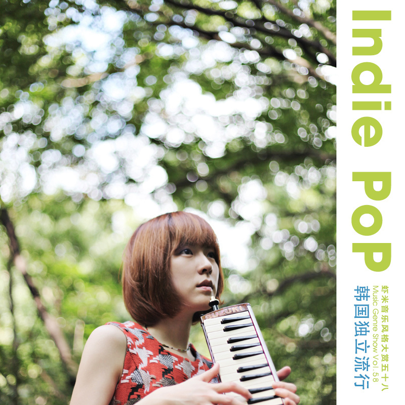
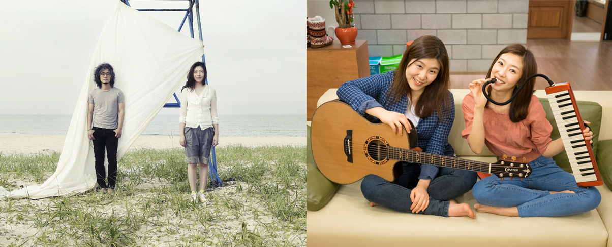

------------------------------------
虾米音乐风格大赏 Vol.58
独立音乐之 韩国独立小清新
------------------------------------

韩语流行音乐之于大众的既定印象是朗朗上口的舞曲，千篇一律漂亮的脸孔与帅气的舞蹈让人审美疲劳，这些包装精美的组合和歌曲被推销到世界各地，被称为韩流。但与其他国家相同，韩国亦有一些不为人知，只专注做自己音乐的独立音乐人们，他们或街头表演或默默发片，没有大力的宣传也没有大量狂热的粉丝，只是安安静静地唱着自己的歌。

Indie是一种态度，一种音乐人对于音乐创作的态度，推而广之，它同样也是听乐人对于音乐取舍的态度。独立音乐是音乐领域中有别于主流商业唱片厂牌或其子公司的音乐存在，音乐的整个创作过程均由音乐家独立完成。虽然许多独立音乐家的风格无法清楚界定，因而归类到不同的音乐类型，但独立音乐在一般说法上或音乐评论中依旧视为一种音乐类型，包括那些非独立制作的音乐。

Indie Pop所折射的是地下音乐柔和、唯美的一面，更着重于声音的融洽、音乐的编排以及歌词的创作。在从Chamber Pop华美的管弦乐编曲到Twee Pop的简单直率中，Indie Pop所包含的一切，其焦点或者说这种音乐的侧重点一如都是歌曲多于声响。

[Yozoh](http://www.xiami.com/artist/23379)在中文里是窈窕的意思，在她甚至还没有表露真实名字的时候，许多人就通过[《咖啡王子一号店》](http://www.xiami.com/album/167969)的OST“GO Go Chan”、“来杯咖啡吧？”记住这把纯净温暖又甜美可爱的声音。

[10cm](http://www.xiami.com/artist/73624)是活跃在弘大的一支独立乐队，由手鼓/主唱权正烈、吉他/合声尹哲钟组成，团名因两人身高差刚好10cm得来。10cm的曲调清新，歌词内容丰富有趣，商业味淡些，人情味浓些，不落俗套又不脱离生活。

[Lucite Tokki](http://www.xiami.com/artist/31830)是一支只在弘大那里唱歌的女子二人BAND，歌曲让人很轻松，知道她们的人应该很少的，因为她们从来不上电视节目，电台也不会请她们做节目，不过这才是真正很纯粹的感觉，没有商业味道，歌声纯净，纯粹。

[屋顶月光](http://www.xiami.com/artist/73075)因为专辑[《28》](http://www.xiami.com/album/438436)里第一首歌的曲名[Dalmoon](http://www.xiami.com/song/1770179807)被很多歌迷误以为那是组合的名字，该曲属于她们俩拿手的哼唱类型（Scat），一开始伴随着钢琴，静谧入心，然后伴随轻盈略微带有Jazz的鼓点，一路悠扬的口琴，之后便是她俩的Scat，优美且动听，最后是以浑厚的萨克斯作为收尾。这首曲子也被韩国SBS电视台2011年电视剧《对我说谎试试》作为插曲多次使用。

[Linus' blanket](http://www.xiami.com/artist/23324)代表对某些事物的过分溺爱和依赖，也就是恋物情节。以Yeongene为首的韩国5人独立乐团利纳斯的毛毯，创作的音乐受60年代的A&M pop和Bossa Nova影响，Linus' Blanket的两张单曲，旋律清新流美，Yeongene摇篮曲般的呢喃，再加上讨巧的曲式编排，洋溢出细腻青涩的动人风情。

[小洋槐乐队](http://www.xiami.com/artist/23272)是一男一女组成的独立乐队，这是一支给人感觉很朴实的乐队，声音安静，旋律感性，歌曲中那种独立虚无的忧郁情调，略带忧伤、冷静，仿佛一种自我的生活态度。他们的音乐没有固定的风格，没有固定的旋律，随心所欲，却是心底最真的感受。

[J Rabbit](http://www.xiami.com/artist/84471)是由钢琴吉他等乐器以及迷人声线所组成的带来清新与温暖的组合。 

IIIIIIIIII 本期制作人：口羊 IIIIIIIIII

[进入 Indie Pop 风格页面](http://www.xiami.com/genre/detail/sid/873)
[收听 Indie Pop 电台](http://www.xiami.com/radio/play/type/13/oid/873)

入选曲目(50)

01. 바나나 파티 -- Yozoh  
“Yozoh在这张专辑当中正式公开自己的名字，还邀请了演奏乐队"小洋槐乐队(A Small Group Acacia Band)"一起来参与整张专辑的音乐制作和演奏，也开始展示自己在作词作曲上的天赋。这首香蕉聚会(Banana Party)歌词俏皮，有着Yozoh独特可爱的演唱风格，弘大女神的魅力一览无余。”

02. 옥상달빛 -- 옥상달빛  
“屋顶月光同名歌曲是她们拿手的哼唱歌曲，让人听来轻松愉悦。”

03. [동거 -- 가을방학](https://dn-songcloud.qbox.me/music/xiami/vol58/03. 同居 - 秋天假期.mp3)  
“秋天假期一如既往的清新歌曲《同居》”

04. 봄봄봄 -- Lucite Tokki  
“Lucite Tokki最新鲜最纯净的音乐《春天 / Spring》”

05. 장가갈 수 있을까 -- 커피소년;내리  
“无法挽留的爱情， 咖啡少年《能够成家吗》？”

06. Windy Spring -- Yeomi  
“轻快明亮的春天味道”

07. Signal Waltz -- Linus' Blanket  
“微醉着轻轻摇晃，看夏日时光一点点消融，是适合午后来聆听的音乐。”

08. [Sugar Sugar -- Ukulele Picnic;IS](https://dn-songcloud.qbox.me/music/xiami/vol58/08. Sugar Sugar (Feat. IS) - Ukulele Picnic.mp3)  
“Ukulele Picnic是韩国第一支Ukulele（尤克里里）乐队，风格十分欢快清晰，给人带来一股夏日的清凉、耳目一新的感觉，就好像来到了夏威夷。”

09. Lalala -- 소규모 아카시아밴드  
“小洋槐乐队代表作，音乐风格随心所欲，旋律干净，歌词柔美。”

10. 속좁은 여학생 -- 브로콜리너마저  
“broccoliyoutoo 《小心眼的女生》”

11. 사랑한대 -- Standing Egg;Windy
“Standing Egg （站立蛋）的三围位成员们有着独特的称号 ：1号蛋，2号蛋，3号蛋。
他们能独自写曲, 填词和制作自己的音乐, 并强调个性,思想, 观念和理念的重要。运用这四种慨念，他们已制作出一个完美的程式，用作一个新鲜和创新的基础曲调。
这是他们一首非常受欢迎的单曲《One love》”

12. Remember -- The Melody
“《Remember》作为电影《甜蜜阴森的恋人》插曲，节奏欢快，歌声温柔甜美，很容易让人心情愉快。”

13. 첫사랑의 멜로디 -- Acoustic Collabo
“Acoustic Collabo 《初恋的旋律》”

14. Fine Thank You And Y... -- 10cm
“10cm温柔的情歌，依然是清新的曲调，有趣的歌词。”

15. Lovin Ice Cream -- As One;Ez-Life
“合声最自然舒服的女子二人组合的As One与 Ez-Life合唱的可爱歌曲《Lovin Ice Cream》也是《对我说谎试试》的插曲。”

16. 손잡고 허밍 (Album ver.) -- 재주소년;Yozoh
“才洲少年 & Yozoh合作电影《长路漫漫》原声 《牵着手哼歌》”

17. 요즘 너 말야 (Album Edit) -- J Rabbit
“来自两只可爱的小兔子——J Rabbit 《最近的你》”

18. 초콜렛군 오렌지양 -- Milktea
“Milktea 《巧克力先生橙子小姐》”

19. Coffee -- 박한별

20. 그게 사랑 -- 달콤한 소금  
“Sweet Salt 《那段爱情》”

21. [너의 의미 -- IU; 김창완](https://dn-songcloud.qbox.me/music/xiami/vol58/21. 你的意义 (Feat. 金昌完) - IU.mp3)  
“IU & 金昌完特别翻唱老歌《你的意义》，这是随着时间流逝也不会褪色的，淳朴美丽的回忆的痕迹。”

22. Teddy Bear Rises -- Oohyo

23. Goodmorning Heaven -- Goodmorning Heaven;하림

24. 토요일 오후에 -- Raspberry Field
“Raspberry Field 《星期六下午》”

25. illa illa -- JUNIEL
“JUNIEL从街头走上主流，从日本唱回韩国的第一张专辑”

26. 있잖아... -- 김여희
“金耀熙 《不是吗...》”

27. Your Sun Is Stupid -- Big Baby Driver

28. 굿모닝 굿나잇 -- M&M
“M&M 《Good Morning Good Night》”

29. 미쳤나봐 -- Soran;권정열 - 10cm
“Soran & 权正烈(10cm) 《要疯了吧》”

30. 200% -- 악동뮤지션
“从小在大自然长大的乐童音乐家，从选秀节目冠军的身份签约YG后依然保持着他们独特的歌词和清爽的旋律。”

31. 7월의 이파네마소녀 -- Casker
“Casker 《七月的伊帕内玛少女》”

32. 슈게이저 -- Misty Blue
“Misty Blue 《盖伊鞋》”

33. 소풍 -- Ignite;이지선(李智善)
“Ignite & 李智善 《兜风》”

34. 사람이었네 -- Lucid fall
“Lucid fall 《人联系到了》”

35. 여름냄새 -- 오후만 있던 일요일
“Sunday Afternoon 《夏天的味道》”

36. Galaxy Tourist -- Peppertones

37. Whose Dream -- Aquibird

38. River -- Fanny Fink

39. 청춘 -- Thomas Cook
“Thomas Cook 《青春》”

40. 여자친구가 생겼으면 좋겠다 -- 소심한 오빠들;쇼코
“小心的哥哥们 《如果有女朋友的话就好了》”

41. 토닥토닥 -- 나겸

42. 완벽한 봄날 -- 동경소녀;소심한 오빠들
“东京少女 & 小心的哥哥们 《完美的春日》”

43. 처음부터 널 -- I:magine
“I:magine 《从一开始就对你》”

44. 우리만나요 (샤이니의 월드데이트 삽입... -- 가내수공업
“家庭手工业 《我们见面吧》”

45. 우리 처음 만난 날 -- 한희정
“韩熙贞 《我们初次相遇那天》”

46. 별거 아닐거란 생각에 -- 수경

47. Everybody Sing A Son... -- Lunchsong;주하

48. Everything -- 이지형

49. 사랑의 1단계 -- Luanne
“Luanne 《爱情的第1步》”

50. My Little Cat -- 허민
